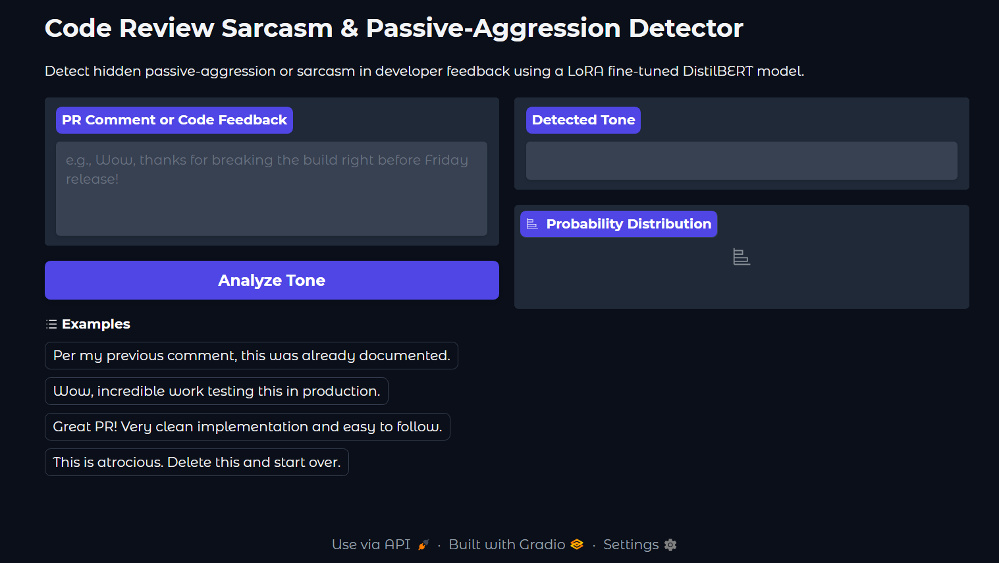
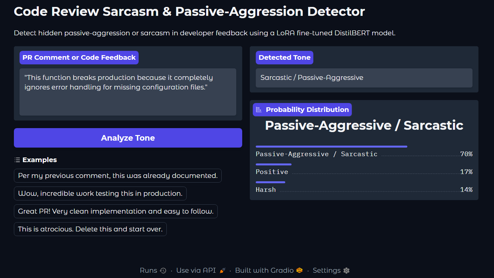
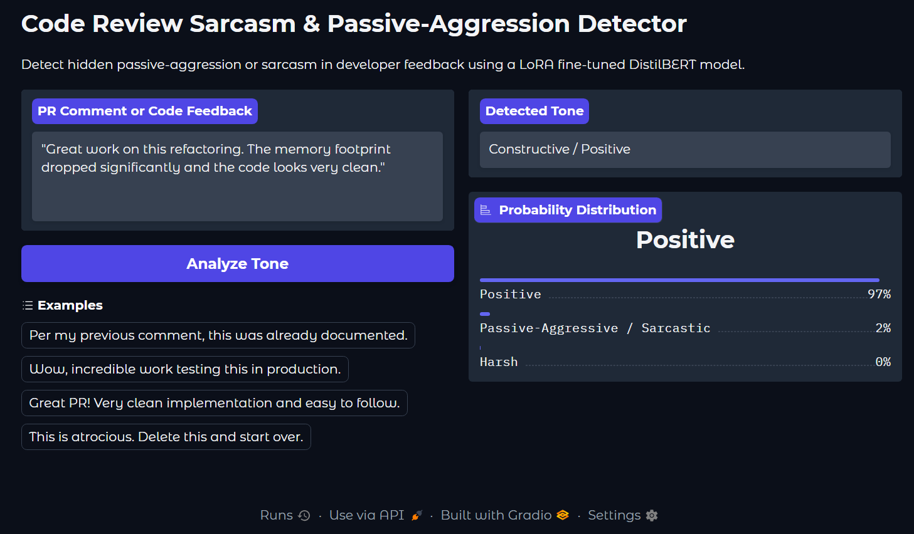
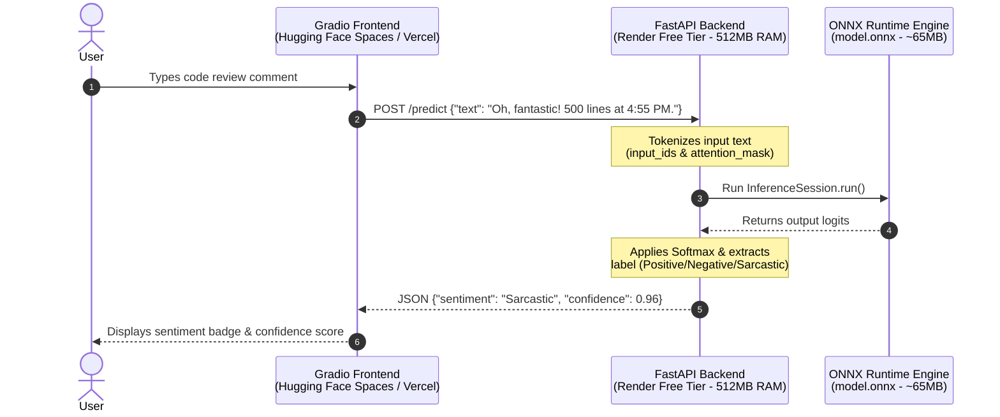

# Code Review Sentiment & Sarcasm Analyzer
An end-to-end NLP service built to analyze code reviews and distinguish between genuine feedback (positive/negative) and sarcastic remarks.

 
This repository covers the complete machine learning lifecycle from dataset curation and Parameter-Efficient Fine-Tuning (PEFT) to ONNX quantization and cloud deployment on Render Free Tier.

---

## Application Demo

| Sarcasm Detection | Genuine Feedback |
| :---: | :---: |
|  |  |

*Web UI built with Gradio and powered by an INT8 Quantized DistilBERT ONNX model hosted on Render.*

---

## Technical Overview



...

## Step-by-Step Implementation

1. Dataset Selection & Preprocessing
    * Objective: Train a model capable of recognizing nuance and sarcasm in developer code review comments.
    * Process:
      * Curated a dataset of code review comments categorized into three sentiment classes: Positive, Negative, and Sarcastic.
      * Cleaned text data by stripping inline code snippets, special syntax artifacts, and normalizing whitespace.
      * Tokenized the text using distilbert-base-uncased with dynamic padding and max-length truncations.

2. Parameter-Efficient Fine-Tuning (PEFT with LoRA)
    * Objective: Adapt a pre-trained transformer efficiently without retraining all parameters.
    * Process:
      * Selected distilbert-base-uncased as the backbone model for its fast inference speed and lightweight memory profile.
      * Injected Low-Rank Adaptation (LoRA) matrices into the query and value projection layers using HuggingFace's peft library.
      * Fine-tuned the model on the task, producing a small parameter adapter (saved_sarcasm_lora_adapter) (~10 MB) while keeping base weights frozen.

3. Merging & Exporting to ONNX
    * Objective: Eliminate heavy PyTorch/Transformers dependencies at runtime to fit within Render's strict 512 MB RAM limit.
    * Challenges Encountered:
      * PyTorch 2.x Exporter Conflicts: Python 3.13 and PyTorch 2.x's default Dynamo exporter (torch.export) threw AttributeError when tracing quantized layers.
      * External Weight Split: Default ONNX exports split large models into a .onnx graph and a 256 MB .onnx.data binary file, exceeding GitHub's 100 MB single-file limit.
    * Solution:
      * Merged the LoRA adapter back into the base DistilBERT weights using lora_model.merge_and_unload().
      * Bypassed Dynamo by using PyTorch's legacy TorchScript tracing engine (dynamo=False in torch.onnx.export).
      * Traced the merged PyTorch graph into a single, unified model.onnx file (256 MB).

4. INT8 Model Quantization
    * Objective: Reduce model size below 100 MB to enable Git tracking and lower server startup memory.
    * Process:
      * Applied Dynamic INT8 Quantization (quantize_dynamic via onnxruntime.quantization).
      * Converted model weight tensors from 32-bit floating point (FP32) to 8-bit integers (QUInt8).
      * Reduced model file size from 256 MB to ~65 MB (~75% reduction) with virtually zero loss in evaluation metrics.

5. Backend Service Implementation
    * Objective: Create a high-throughput, low-latency REST API.
    * Process:
      * Built an API server using FastAPI.
      * Replaced PyTorch runtime with ONNX Runtime (onnxruntime), reducing total memory footprint from >1.2 GB down to <80 MB RAM during inference.
      * Configured endpoints to accept raw code review strings, tokenize them via HuggingFace's tokenizers, execute InferenceSession, and return class probabilities.

6. Frontend & Final Cloud Deployment
    * Objective: Host the service publicly on Render.
    * Process:
      * Built an interactive demo frontend using Gradio.
      * Tracked the quantized model.onnx (~65 MB) directly in Git.
      * Deployed the FastAPI backend to Render's Free Tier (512 MB RAM / 0.1 CPU).
      * Connected the Gradio interface to the Render REST API endpoint for real-time predictions.
---

## Project Structure

  ```bash
  ├── backend/
  │   ├── main.py                  # FastAPI server loading lightweight ONNX model
  │   └── convert-to-onnx.py       # LoRA weight merging & legacy ONNX export script
  ├── models/
  │   ├── saved_sarcasm_lora_adapter/  # Trained LoRA adapter weights
  │   └── onnx_light/
  │       ├── model.onnx           # Final INT8 quantized model (~65 MB)
  │       ├── tokenizer.json       # Tokenizer configs
  │       └── vocab.txt
  ├── run_quantize.py              # Script to perform INT8 ONNX dynamic quantization
  ├── requirements.txt             # Minimal backend dependencies (onnxruntime, fastapi, etc.)
  └── README.md
  ```

---

## Local Setup & Development

1. Clone & Install Dependencies

   ```bash
    git clone https://github.com/prachig09/code-review-sentiment-analyzer.git
    cd code-review-sentiment-analyzer
    
    python -m venv venv
    source venv/bin/activate  # On Windows: venv\Scripts\activate
    pip install -r requirements.txt
    ```

2. Run Export & Quantization Pipeline
    If modifying the adapter or model, regenerate the quantized ONNX file:

    ```bash
      # Export merged model to ONNX
      python backend/convert-to-onnx.py
      
      # Quantize model to INT8 (~65 MB)
      python run_quantize.py
    ```

3. Launch Backend API
    ```bash
      uvicorn backend.main:app --reload
    ```
